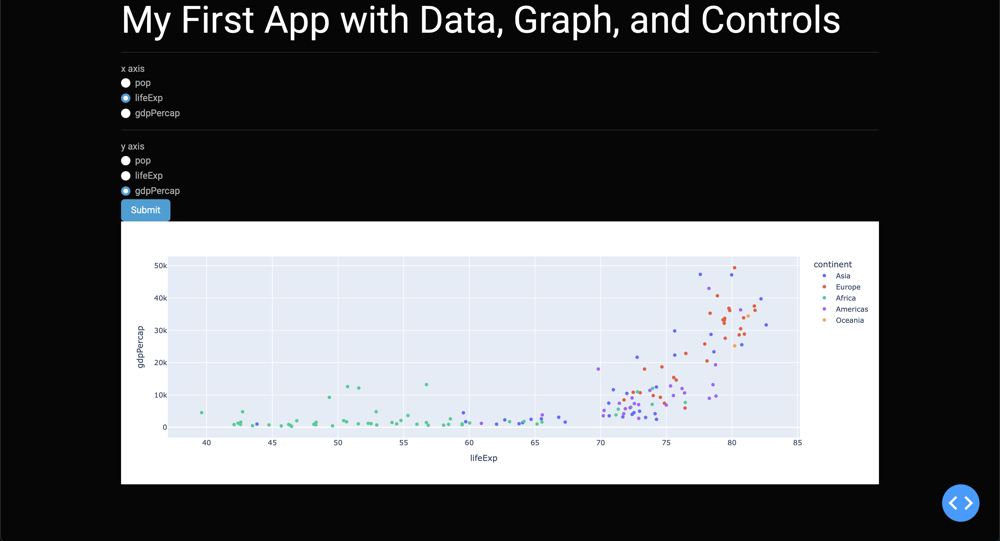

# Dash Scatter Plot App

This is a simple interactive Dash web application that allows users to visualize data using a scatter plot. Users can select the x-axis and y-axis variables from a predefined set of options, and the app will generate a scatter plot accordingly. The app also includes an alert message to prevent users from selecting the same variable for both axes.

### Features
- Interactive scatter plot using plotly.express

- Dropdown radio buttons for selecting x and y axes

- Alert message if x and y axes are the same

- Dark theme using Dash Bootstrap Components (CYBORG theme)

- Built-in button to update the graph upon selection

### Requirements
You can find the libraries used and their versions in **requirements.txt**

### Project Structure
DASH/
│── data/
│   └── gapminder2007.csv  # Dataset used in the app
│── example_screenshot/
│   └── example.png  # example screenshot
│── app.py                 # Main Dash application file
│── README.md 
│── requirements.txt

### Running the app
Just ensure you have the **gapminder2007.csv** file in the **data** folder

### How it works
- This app loads data from **gapminder2007.csv**
- Users can select **pop**, **lifeExp** or **gpdPercap** for both x and y axis
- Pressing the **submit** button updates the graph
    - If the same variable is selected for both axes, an alert is triggered

### Example

### License
I made this project for educational purposes only

### Author
Jorge Brehm Gómez
